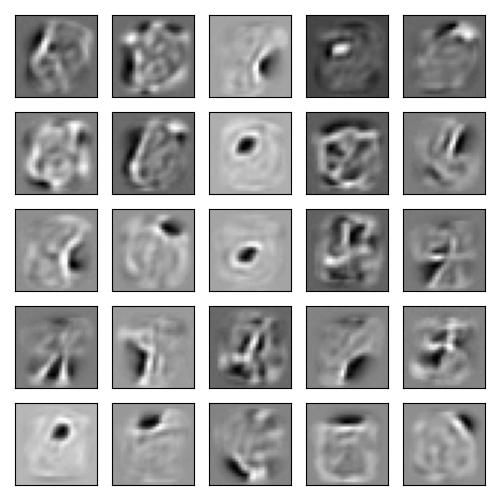

# Deep Energy-Based Models (DEBM)
Work in progress... It is a repository to test ideas on energy modeling for image generation (e.g. Boltzmann machines, denoising diffusion).  

---
At the moment, this repo has got only some basic stuff as the following...

The training script is designed for a poor person with a laptop GPU (or no GPU) to train RBM and Diffusion models on MNIST or CIFAR10 datasets.

You can specify in command line:
```
python3 main.py --model_name=rbm --dataset_name=mnist --n_epochs=100
```

RBM often is useful to learn image features. For 100 epochs of default model at default learning rate, you will see something like this.



At the moment RBM only learns to reconstructed an image from hidden -> visible layers, that is not like generating an image from a text prompt. You will see a blurry reconstruction from the original. It is still pretty cool given that the reconstruction is done by **unsupervised learning** i.e. contrastive divergence.


Diffusion is a denoising probabilistic model. It is more powerful but is a scored-based model (other than energy). Training diffusion is slow, you can give a try in command line:
```
python3 main.py --model_name=diffusion --dataset_name=mnist --n_epochs=10 --learning_rate=0.001
```
Here is an example of a generated image from denosing diffusion probabilistic models after 10 epochs.


